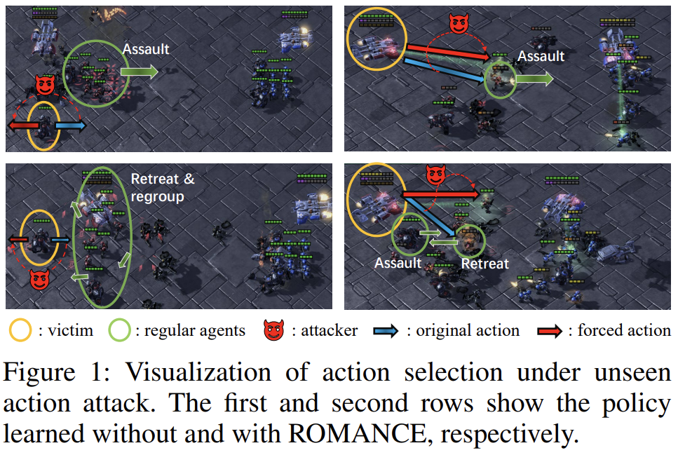
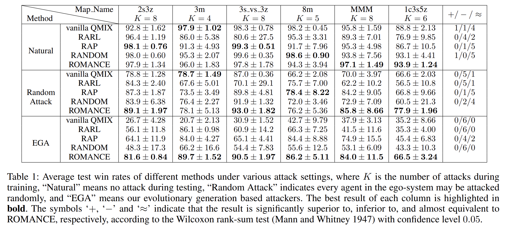

# Robust Multi-agent Coordination via Evolutionary Generation of Auxiliary Adversarial Attackers

This repository contains implementation for Robust Multi-agent Coordination via Evolutionary Generation of Auxiliary Adversarial Attackers (ROMANCE).

This work is accepted at the Association for the Advancement of Artificial Intelligence (AAAI) 2023.

## Environment Installation

Build the environment by running:

```sh
pip install -r requirements.txt
```

or

```sh
conda env create -f environment.yaml
```

## Running

Some example scripts have been provided for this. The code allows various parameters in the model names to enable different settings.

By running:

```shell
python3 src/main.py --config=qmix_robust --env-config=sc2 with env_args.map_name=2s3z
```

diverse adversarial attackers against trained ego-system can be generated.

By running:

```shell
python3 src/main.py --config=qmix_robust --env-config=sc2 with env_args.map_name=2s3z attack_num=8
python3 src/main.py --config=vdn_robust --env-config=sc2 with env_args.map_name=2s3z attack_num=8 ego_agent_path="./ego_models/vdn_2s3z"
```

robust ego-system on map 2s3z will be generated.

We provide pre-trained agents (vanilla QMIX), advesarial attackers and robust trained agents (ROMANCE) on map 2s3z, 3s_vs_3z for quick evaluation by running:

```sh
bash run_evaluate.sh 2s3z
bash run_evaluate.sh 3s_vs_3z
```

## Visualization of Attack and Defense



## Comparison with Baselines




## License

All the source code that has been taken from the EPyMARL repository was licensed (and remains so) under the Apache License v2.0 (included in LICENSE file). Any new code is also licensed under the Apache License v2.0.

## Citation
TBD

